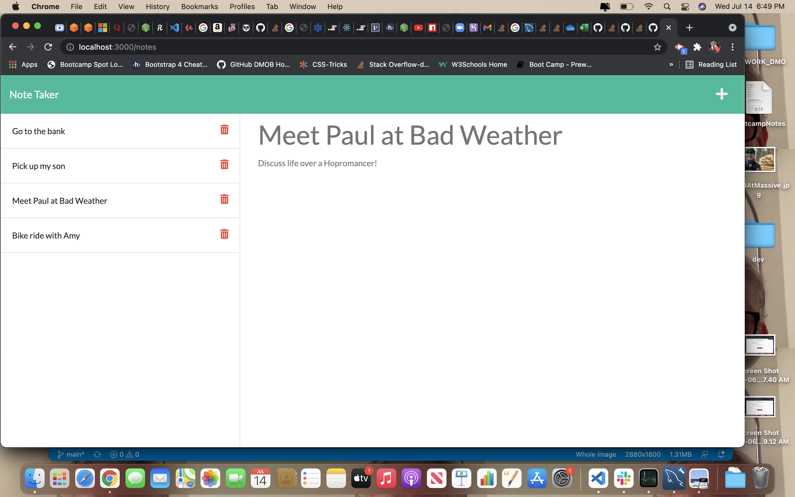

# hw11-note-taker-app

## Table of Contents
1. [General Info](#general-info)
2. [Screenshot](#screenshot)
3. [Technologies](#technologies)
4. [Installation](#installation)
5. [FAQs](#faqs)
### General Info
***
### David OBrien's Note Taker Application

Web based application allowing user to save notes to document db; hosted
on Express local server.

### Screenshot

## Technologies
***
A list of technologies used within the project:
  * HTML
  * Bootstrap
  * Javascript
  * jQuery
  * Node.js
  * Express.js
  * fs
  * Heroku

## Installation
***

Link to github repository- https://github.com/dmobrienllc/hw11-note-taker-app

Link to live site- 

## FAQs
***

Q Is this application awesome?

A Why yes it is!

